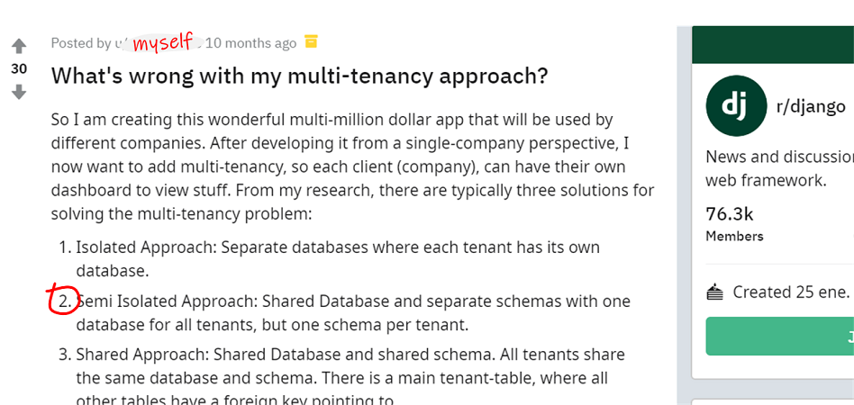
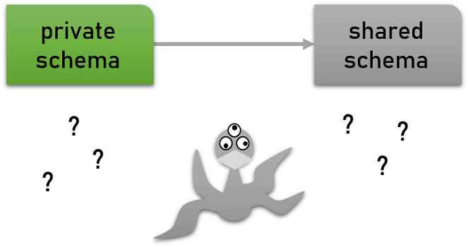

class: middle center


---

class: middle center


---

class: middle center

.left-column[]

--


---

class: middle center


---

class: middle center



---

name: title
class: middle

# Of Django, PostgreSQL schemas<br/>and your multi-million dollar idea

<hr/>


---

## Who am I?

.left-column-66[

##### Lorenzo Peña &middot; `lorinkoz`

-   Proud citizen of Holguín, Cuba.
-   Django developer for 11 years.
-   Open source contributor.
-   Chaser of multi-tenancy beasts.

]
.right-column-33[]

---

class: middle

.center[]

---

class: middle

.center[]

---

layout: false
class: middle

# From multi-tenancy to PostgreSQL schemas

---

layout: true

## Multi-tenancy

---

-   Customer .red[**red**] has a problem.

--

-   You develop a solution.

--

-   Now, customers .blue[**blue**], .green[**green**] and .yellow[**yellow**] have the same problem.

--

.left-column-66[.box[🤔 What to do?]]
.right-column-33[.right[]]

---

.center[]

---

.center[]

---

.left-column-33[
.center[ Accounts]
]

.left-column-33[
.center[ Workspaces]
]

.left-column-33[
.center[ Blogs]
]

.left-column-33[
.center[ Servers]
]

.left-column-33[
.center[ Stores]
]

.left-column-33[
.center[ Sites]
]

---

layout: false
class: middle center

.center[]

---

layout: true

## Database approaches

---

**Isolated:**<br/>Multiple databases, one per tenant.

**Shared:**<br/>One database, tenant column on entry-level tables.

**Semi-isolated:**<br/>One database, one schema per tenant (PostgreSQL).

---

layout: true

## PostgreSQL schemas

---

.left-column-66[PostgreSQL schemas.ref[1] can isolate tenants within a single database.
{{content}}]
.right-column-33[.right[]]

.bottom[
.footnote[.ref[1] https://www.postgresql.org/docs/current/ddl-schemas.html]
]

--

##### Schemas:

-   Layer between database and tables.
-   Equivalent to namespaces.
-   Searchable through the **search path**.

---

```sql
SET search_path = schema_1, schema_0
SET search_path = schema_2, schema_0
...
```

.center[]

---

layout: true

## Schemas in Django

---

--

##### Established packages

-   [bernardopires/django-tenant-schemas](https://github.com/bernardopires/django-tenant-schemas)
-   [tomturner/django-tenants](https://github.com/tomturner/django-tenants)

--

##### My own experimental package

-   [lorinkoz/django-pgschemas](https://github.com/tomturner/django-pgschemas)

---

```python
from django.db.backends.postgresql import base as postgresql


class DatabaseWrapper(postgresql.DatabaseWrapper):
    def _cursor(self, name=None):
        # Over simplified!!!
        cursor = super()._cursor(name=name)
*       tenant = get_current_tenant()
*       schemas = get_schemas_from_tenant(tenant)
        search_path = ",".join(schemas)
        cursor.execute(f"SET search_path = {search_path}")
        return cursor
```

---

```python
class SchemasDatabaseRouter:

    def allow_migrate(self, db, app_label, model_name, ...):
        tenant = get_current_tenant()
        return `model_belongs_to_tenant`(
            app_label, model_name, tenant
        )
```

--

.warning[⚠️ The `migrate` command itself requires tweaking]

---

layout: false
class: middle

# Why schemas?

--

-   Wait, there were other options?
-   Sense of security
-   Less burden of queries
-   Customization of tenants
-   Easier backup / restore flow of tenants
-   Hype

---

layout: false
class: middle center


---

layout: false
class: middle

> Sensible people will see trouble coming and avoid it,
> but an unthinking person will walk right into it and regret it later.
>
> Proverbs 22:3 GNT

---

layout: false
class: middle

# Untangling the schemas

---

layout: true

## Arranging schemas

---

--

.box[💡 Not all schemas correspond to tenants]

--

.center[]

---

`products.models.Product`

.center[]

---

`catalogs.models.ProductClassifier`

.center[]

---

Django migrations

.center[]

---

```python
# settings.py

SHARED_APPS = [...]
TENANT_APPS = [...]

INSTALLED_APPS = SHARED_APPS + TENANT_APPS

```

--

.box[🤔 Why at the app level and not at the model level?]

---

##### What is the Python representation of a tenant?

--

```python
class Tenant:

    schema_name = "schema_1"
```

--

```python
class TenantMixin(models.Model):

    schema_name = models.CharField(...)

    class Meta:
        abstract = True
```

---

layout: true

## Where to put users

---

--


---

.center[]

---

.center[]

---

##### Free users:

-   Require tenant binding via database.
-   Possibly define the active tenant.

##### Bound users:

-   Require an active tenant.

---

##### Careful with database sessions:

`django.contrib.sessions`

-   Source of leaking authentication.
-   Must be equally or more strict than users.

--

.box[🦉 Keep them together with users]

---

layout: true

## Where to put content types

---

--

`django.contrib.contenttypes`

##### Helpful for:

-   Generic relations.
-   Polymorphism..ref[1]
-   Other unnamed wizardries.

.bottom[
.footnote[.ref[1] https://github.com/django-polymorphic/django-polymorphic]
]

---

.center[]

---

##### Free content types:

-   Consistent across tenants.

##### Bound content types:

-   Portable with tenants.
-   Requires clearing the content types cache when changing the active tenant.

---

layout: true

## Moving models between schemas

---

--

We are using the `allow_migrate` of a database router.

--

.box[💡 Migrations are still recorded as being applied]

--

.warning[⚠️ Moving models between schemas implies applying migrations differently]

---

##### Strategy:

-   Unapply migrations of the app.
-   Change "app to schema" configuration.
-   Apply migrations of the app.

--

.box[🦉 This is also why we operate at the application level]

---

##### .red[What if there is data?]

-   Search path hides the tables.
-   Hard to do with migrations.
-   Recommended with some form of export / import.

--

.box[💡 Avoid whenever possible]

---

layout: false
class: middle center


---

layout: false
class: middle

# The plot thickens

---

layout: true

## Cross-tenant aggregations

---

.center[]

---

##### Strategy:

-   Iterate through tenants.
-   Background job with cached results.

---

##### Careful with IDs:

-   Repeated across tenants.
-   Don't guarantee uniqueness.

--

.box[💡 Use global identifiers in addition to local IDs]

---

layout: true

## Faster tenant creation

---

--

##### By default:

-   Schema creation implies running all migrations from zero.
-   Migrations are not necessarily optimal.
-   Migrations can take time.
-   Additional data initialization can take time.

---

.box[💡 Create an extra schema for cloning]

--

-   Keep it up to date with structure.
-   Keep it up to date with initial data.

---

layout: true

## Migrating the hundreds

---

.center[]

---

.center[]

---

##### Possible strategies:

-   Sequential
-   Coordinated
-   Time-zone clustered
-   Just-in-time

---

layout: true

## Zero downtime deployments

---

--

.box[🦉 Make your code resilient]

--

##### Culture:

-   Embrace multi-phase deployments.
-   Always make migrations reversible.
-   Be prepared to reverse migrations.

---

##### Strategy:

-   Change code to handle both old and new structure.
-   Mutate structure.
-   Update code for new structure alone.

--

.box[💪 Work out the multi-phase deployment muscle]

---

layout: false
class: middle center

.center[]

---

layout: false
class: middle

# Beware of the behemoth

---

layout: true

## Tables, tables and more tables

---

--

There is no .strike[practical] theoretical limit on the number of tables in a given database..ref[1]

.bottom[
.footnote[.ref[1] https://www.postgresql.org/message-id/53386E0C47E7D41194BB0002B325C997747F2B@NTEX60]
]

--

.red[In theory, theory is enough, but practice shows otherwise.]

--

.warning[⚠️ There is a practical limit!]

---

##### Million tables factor

--

.center[]

.box[🐍 `tables_per_tenant \* number_of_tenants / 10\*\*6`]

---

.right[

|            | 50   | 100  | 500  | 1k   | 5k         | 10k        | 50k         | 100k        |
| ---------- | ---- | ---- | ---- | ---- | ---------- | ---------- | ----------- | ----------- |
| .bold[50]  | 0.00 | 0.01 | 0.03 | 0.05 | 0.25       | 0.50       | .red[2.50]  | .red[5.00]  |
| .bold[100] | 0.01 | 0.01 | 0.05 | 0.10 | 0.50       | .red[1.00] | .red[5.00]  | .red[10.00] |
| .bold[150] | 0.01 | 0.02 | 0.08 | 0.15 | .red[0.75] | .red[1.50] | .red[7.50]  | .red[15.00] |
| .bold[200] | 0.01 | 0.02 | 0.10 | 0.20 | .red[1.00] | .red[2.00] | .red[10.00] | .red[20.00] |
| .bold[250] | 0.01 | 0.03 | 0.13 | 0.25 | .red[1.25] | .red[2.50] | .red[12.50] | .red[25.00] |
| .bold[300] | 0.02 | 0.03 | 0.15 | 0.30 | .red[1.50] | .red[3.00] | .red[15.00] | .red[30.00] |

]

.bottom[
.footnote[Columns are number of tenants, rows are number of tables, intersection shows the million tables factor for the given row and column.]
]

---

.right[

|            | 2k   | 3k         | 4k         | 5k         | 6k         | 7k         | 8k         | 9k         |
| ---------- | ---- | ---------- | ---------- | ---------- | ---------- | ---------- | ---------- | ---------- |
| .bold[50]  | 0.10 | 0.15       | 0.20       | 0.25       | 0.30       | 0.35       | 0.40       | 0.45       |
| .bold[100] | 0.20 | 0.30       | 0.40       | 0.50       | 0.60       | 0.70       | .red[0.80] | .red[0.90] |
| .bold[150] | 0.30 | 0.45       | 0.60       | .red[0.75] | .red[0.90] | .red[1.05] | .red[1.20] | .red[1.35] |
| .bold[200] | 0.40 | 0.60       | .red[0.80] | .red[1.00] | .red[1.20] | .red[1.40] | .red[1.60] | .red[1.80] |
| .bold[250] | 0.50 | .red[0.75] | .red[1.00] | .red[1.25] | .red[1.50] | .red[1.75] | .red[2.00] | .red[2.25] |
| .bold[300] | 0.60 | .red[0.90] | .red[1.20] | .red[1.50] | .red[1.80] | .red[2.10] | .red[2.40] | .red[2.70] |

]

.bottom[
.footnote[Columns are number of tenants, rows are number of tables, intersection shows the million tables factor for the given row and column.]
]

---

##### Scary number of tenants

--

.center[]

.box[🐍 `10\*\*6 / tables_per_tenant`]

---

.box[💡 Not a Django-specific problem]

--

.box[🦉 Schema-related behemoths are actually smaller than they appear]

---

layout: false
class: middle center


---

layout: true

## The moment of sharding

---

--

##### Sharding:

Horizontal partitioning of data.

-   Logical shards
-   Physical shards

Logical shards map to physical shards.

---

-   Schemas will be the minimum decomposable unit.
-   Physical shards must be routed along with schemas.

--

```python
class Tenant:

    schema_name = "schema_1"
    logical_shard = 1
```

---

```python
class ShardedSchemasDatabaseRouter:

    def db_for_read(model, ...):
        ...

    def db_for_write(model, ...):
        ...

    def allow_migrate(self, db, app_label, model_name, ...):
        ...
```

.bottom[
.footnote[https://github.com/lorinkoz/django-pgschemas/pull/41]
]

---

##### What to do with shared apps?

.warning[⚠️ No cross-database relations allowed]

--

-   Keep shared apps synchronized across physical shards.
-   Don't have relations with shared apps.

--

.warning[⚠️ Extra care with free users]

---

.center[]

---

layout: true

## The moment of .red[chaos]

---

--

.red[What if, after all, schemas were not enough?]

--

.center[]

---

##### Some say:

> When you find out schemas are not enough, you should have enough money to afford a rewrite.

##### But remember:

> Sensible people will see trouble coming and avoid it,
> but an unthinking person will walk right into it and regret it later.

---

layout: true
class: middle

# In conclusion

---

---

1. Is multi-tenancy through schemas de-facto wrong?
2. Should you use schemas in your next SaaS project?
3. Should you change your database architecture now?

---

layout: false

## Alternative packages

##### Shared database

-   [citusdata/django-multitenant](https://github.com/citusdata/django-multitenant)
-   [raphaelm/django-scopes](https://github.com/raphaelm/django-scopes)

---

layout: false

## And that's it!

##### We can keep in touch here:

|         |                                                    |
| ------- | -------------------------------------------------- |
| Twitter | [@lorinkoz](https://twitter.com/lorinkoz)          |
| GitHub  | [github.com/lorinkoz](https://github.com/lorinkoz) |
| Email   | [lorinkoz@gmail.com](mailto:lorinkoz@gmail.com)    |

##### Special thanks to:

Katie McLaughlin

---

template: title
