class: middle center

### Yes, this is the first slide

---

class: middle center

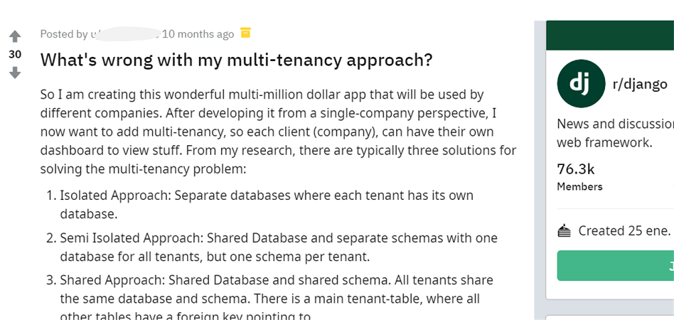

???

“What’s wrong with my multi-tenancy approach”, was the question in this Reddit post I found some weeks ago...

---

class: middle center

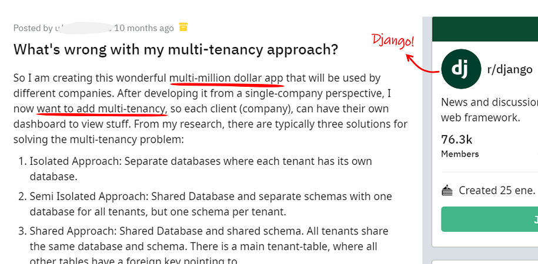

???

...from a person that was intending to create a multi-million-dollar app in Django by means of adding multi-tenancy to a previously existing single-tenant project.

---

class: middle center

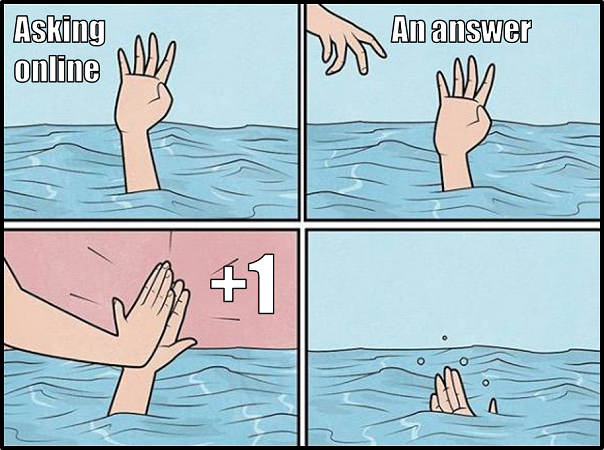

???

I felt quite identified with the redditer, since I myself had the same question a couple of years ago. And, despite the fact that I took a different approach than this person, it’s true that there’s more than this mate and me out in the ocean wondering what is wrong with the path they have taken, or are about take, when it comes to multi-tenancy in Django.

---

class: middle center

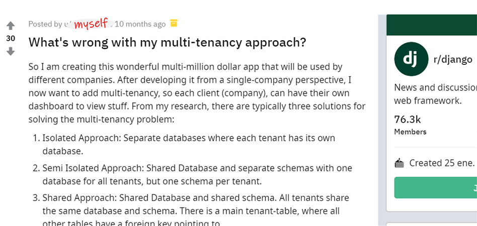

???

But anyways, I now feel in a much better position to answer this mate and myself of what was wrong then and what could still be wrong today.

---

name: title
class: middle

# Of Django, PostgreSQL schemas<br/>and your multi-million dollar idea

<hr/>


???

So, if you’ve ever woken up with a multi-million-dollar idea for a multi-tenancy project in Django, and you’ve made the decision to do so through PostgreSQL schemas, this talk is definitely for you.

---

## Who am I?

.left-column-66[

##### Lorenzo Peña

-   Proud citizen of Holguín, Cuba.
-   Django developer for 11 years.
-   Chaser of multi-tenancy beasts.

]
.right-column-33[]

---

class: middle

.center[]

---

class: middle

.center[]

---

layout: false
class: middle

# From multi-tenancy to<br/>PostgreSQL schemas in Django

---

layout: true

## Multi-tenancy

---

--

-   Customer .red[**red**] has a problem.

--

-   You develop a solution.

--

-   Now, customers .blue[**blue**], .green[**green**] and .yellow[**yellow**] have the same problem.

--

.left-column-66[.box[🤔 What to do?]]
.right-column-33[.right[]]

---

.center[]

---

.center[]

---

.left-column-33[
.center[ Workspaces]
]

.left-column-33[
.center[ Accounts]
]

.left-column-33[
.center[ Blogs]
]

.left-column-33[
.center[ Servers]
]

.left-column-33[
.center[ Stores]
]

.left-column-33[
.center[ Sites]
]

---

layout: false
class: middle center

.center[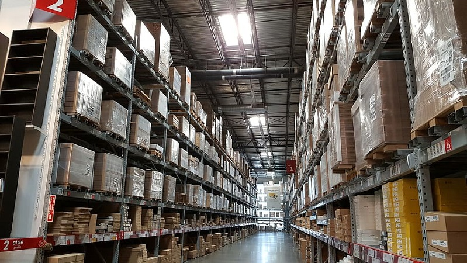]

---

layout: true

## Database approaches

---

**Isolated:**<br/>Multiple databases, one per tenant.

**Shared:**<br/>One database, tables scoped by tenant.

**Semi-isolated:**<br/>One database, one PostgreSQL schema per tenant.

---

layout: true

## PostgreSQL schemas

---

.left-column-66[

##### Schemas:.ref[1]

-   Layer between database and tables.
-   Equivalent to namespaces.
-   In the face of ambiguity, precedence is set through the **search path**.

]
.right-column-33[.right[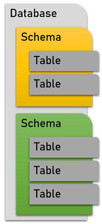]]

.bottom[
.footnote[.ref[1] https://www.postgresql.org/docs/current/ddl-schemas.html]
]

--

```sql
SET search_path = schema_a,schema_b,public
```

---

```sql
SET search_path = schema_1,public
SET search_path = schema_2,public
...
```

.center[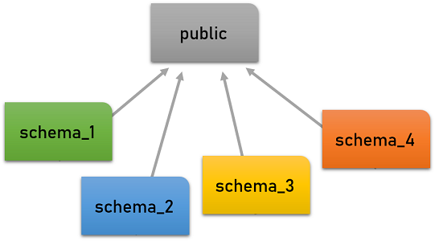]

---

layout: true

## PostgreSQL schemas .green[in Django]

---

--

##### Established packages:

-   [bernardopires/django-tenant-schemas](https://github.com/bernardopires/django-tenant-schemas)
-   [tomturner/django-tenants](https://github.com/tomturner/django-tenants)

--

##### My own experimental package:

-   [lorinkoz/django-pgschemas](https://github.com/tomturner/django-pgschemas)

---

##### The three cornerstones of the packages:

--

.box[Custom database backend to set the `search_path`]

--

.box[Custom `migrate` command to operate with schemas]

--

.box[Custom database router with `allow_migrate`]

---

layout: false
class: middle

--

# Why schemas?

--

-   Wait, there were other options?
-   Sense of security
-   Less burden of queries
-   Customization of tenants
-   Easier backup / restore flow of tenants
-   Hype

---

layout: false
class: middle center


---

layout: false
class: middle

# Untangling the schemas

---

layout: true

## Tenants, schemas and models

---

--

##### What is the Python representation of a tenant?

--

```python
# abstract_concept.py
tenant = Tenant(schema_name="schema_1")
```

--

```python
# models.py
class Tenant(models.Model):
    schema_name = models.CharField(unique=True, ...)
```

---

.box[💡 All tenants have an associated schema]

--

.box[🤚 Not all schemas have a corresponding tenant]

--

.center[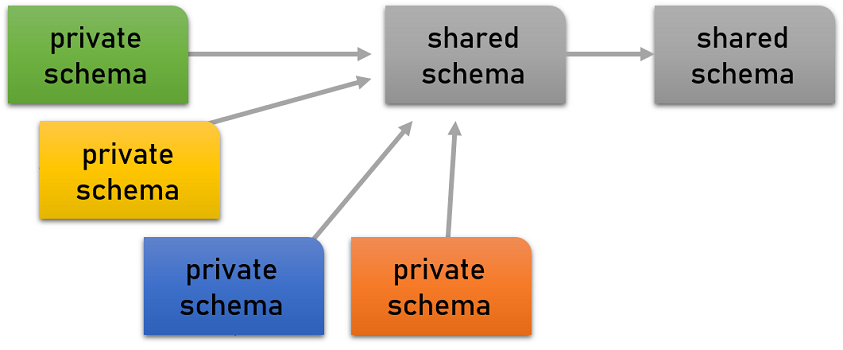]

---

```python
# settings.py

SHARED_APPS = [...]
TENANT_APPS = [...]

INSTALLED_APPS = SHARED_APPS + TENANT_APPS

```

--

.box[🤔 Why at the app level and not at the model level?]

---

##### Tenant (private) models

.left-column[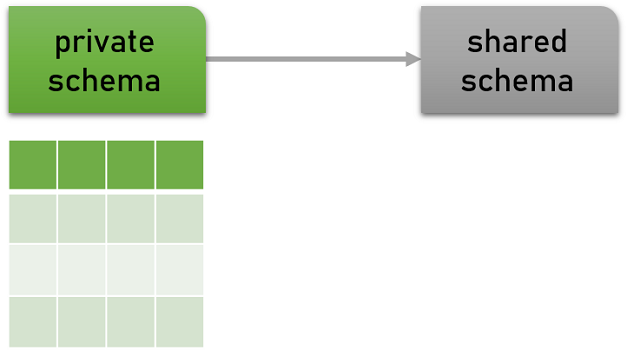]
.right-column[

-   Tenant specific models
-   Customizable catalogs
    ]

---

##### Shared models

.left-column[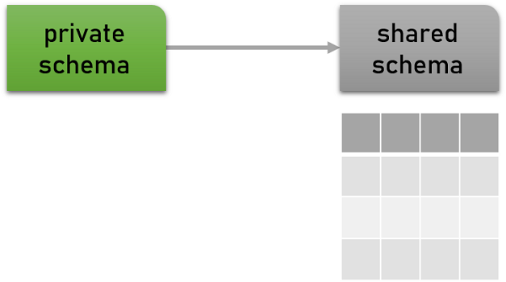]
.right-column[

-   The tenant catalog
-   Read-only catalogs
-   System-wide data
-   Cached aggregations
-   High volume writes
    ]

---

##### Duplicated (hidden) models

.left-column[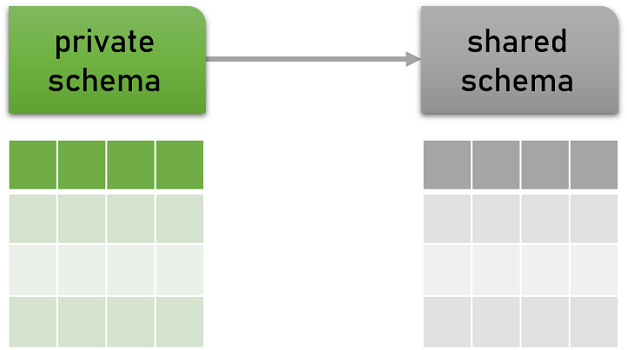]
.right-column[

-   Django migrations
-   Content types.ref[1]
-   Other meta models
    ]

.bottom[
.footnote[.ref[1] With known side effects]
]

---

layout: true

## Where to put users?

---

--

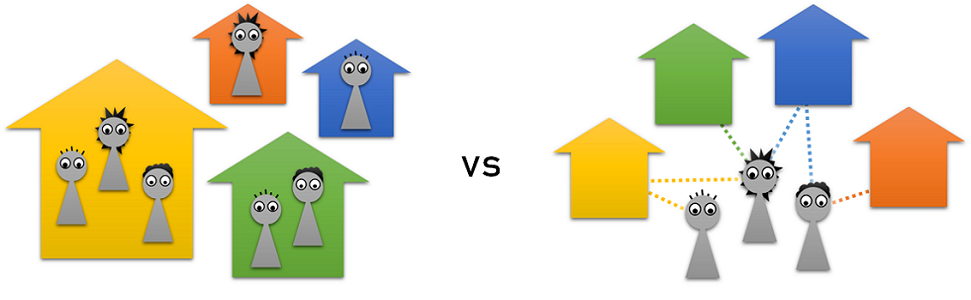

--

.left-column[.center[]]
.right-column[.center[]]

---

##### Bound users

.right-column-66[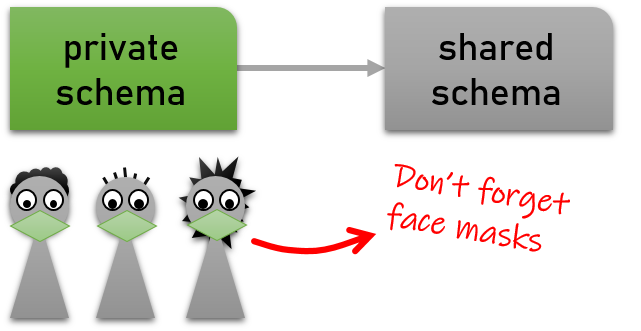]
.left-column-33[]
.left-column-33[
Require an active tenant
]

---

##### Free users

.right-column-66[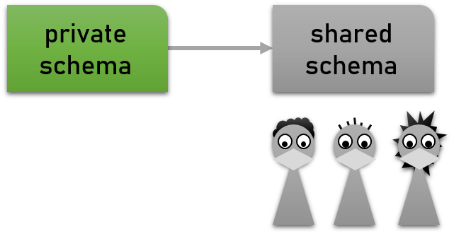]
.left-column-33[]
.left-column-33[
Require database binding with tenants
]

---

##### .red[Careful with database sessions!]

`django.contrib.sessions`

-   Source of leaking authentication.
-   Must be equally strict or stricter than users.

--

.box[🦉 Keep them together with users]

---

layout: true

## Moving models between schemas

---

--

We are using the `allow_migrate` of a database router.

--

.box[💡 Migrations are still recorded as being applied]

--

.warning[⚠️ Migrations must be reapplied differently]

---

##### Strategy:

-   Unapply migrations of the app.
-   Change "app to schema" configuration.
-   Apply migrations of the app again.

--

.box[🦉 Avoid having data before you have a stable layout]

---

layout: false
class: middle center


---

layout: false
class: middle

# The plot thickens

---

layout: true

## Tenant creation is slow

---

--

##### Why?

-   Schema creation implies running all migrations from zero.
-   Migration history is not necessarily optimal.
-   Additional data initialization can take time.

--

.box[💡 Provision a special schema for cloning]

---

layout: true

## You know what else is slow?

---

---

.left[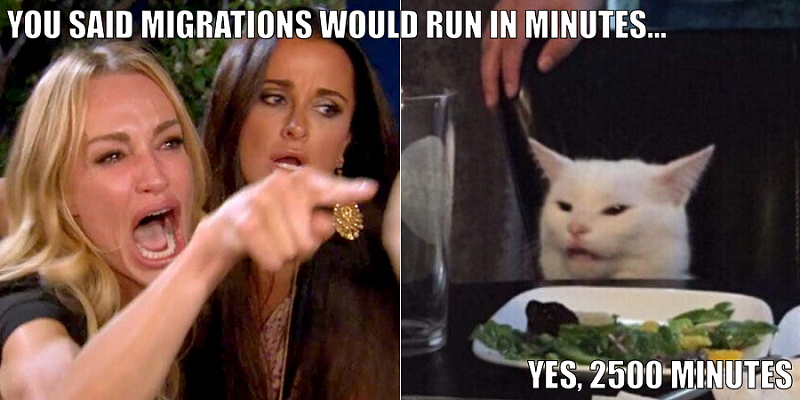]

---

.left-column-66[]

--

.right-column-33[There are strategies to reduce the time...<br/><br/>]

--

.right-column-33[.warning[Migrations will still be slow!]]

---

layout: true

## Zero downtime deployments

---

--

.box[🦉 Make your code resilient]

--

##### Culture:

-   Embrace multi-phase deployments.
-   Always make migrations reversible.
-   Be prepared to reverse migrations.

---

##### Strategy:

-   Change code to handle both old and new DB structure.
-   Mutate DB structure.
-   Update code for new DB structure alone.

--

.box[💪 Work out the multi-phase deployment muscle]
.center[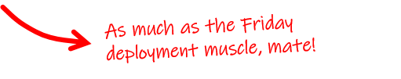]

---

layout: true

## Other middle-term challenges

---

---

-   Data recollection across tenants.
-   Backup / restore flow of tenants with free users.
-   What to do with unique, general purpose tenants like a master site, a blog or the help center.

--

.center[]

---

layout: false
class: middle center

.center[]

---

layout: false
class: middle

# The size of the behemoth

---

layout: true

## Tables, tables and more tables

---

--

There is no practical limit on the number of tables in a given database..ref[1]

.bottom[
.footnote[.ref[1] https://www.postgresql.org/message-id/53386E0C47E7D41194BB0002B325C997747F2B@NTEX60]
]

--

.warning[⚠️ There is a practical limit!]

---

.emph[A million] is a scary number of tables to have in a single database.

--

.left-column-66[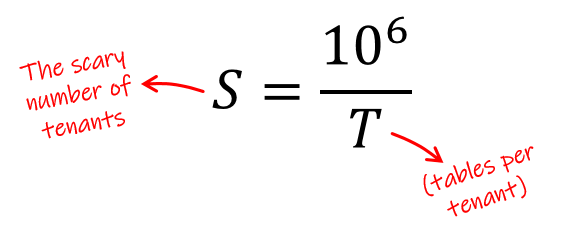]

--

.right-column-33[

.center[

| T   | S    |
| --- | ---- |
| 50  | 20k  |
| 100 | 10k  |
| 150 | 6.7k |
| 200 | 5k   |

]
]

---

.box[💡 Not a Django-specific problem]

--

.box[🦉 Schema-related behemoths are not that massive]

---

layout: true

## What if we shard?

---

--

.center[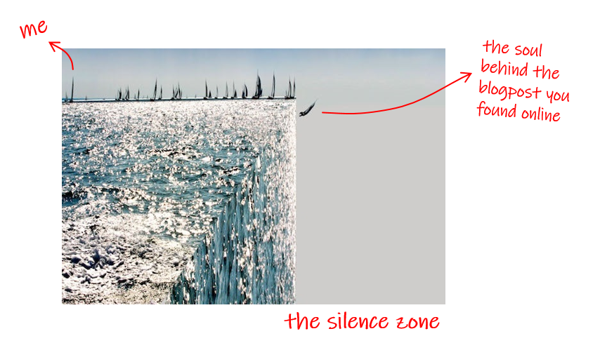]

---

.box[🤓 Let's try it in the Django side]

--

##### Strategy:

-   Schemas will be the minimum decomposable unit.
-   Physical shards must be routed along with schemas.

--

```python
tenant = Tenant(schema_name="schema_1", logical_shard=1)

database = get_physical_shard_from_tenant(tenant)

```

---

```python
class ShardedSchemasDatabaseRouter:

    def db_for_read(model, ...):
        # Physical shard as default value
        ...

    def db_for_write(model, ...):
        # Physical shard as default value
        ...

    def allow_migrate(self, db, app_label, model_name, ...):
        # Same implementation of the selected package
        ...
```

.bottom[
.footnote[https://github.com/lorinkoz/django-pgschemas/pull/41]
]

---

.warning[⚠️ There are now multiple shared schemas]

--

.warning[⚠️ For free users, there are now multiple catalogs]

---

.center[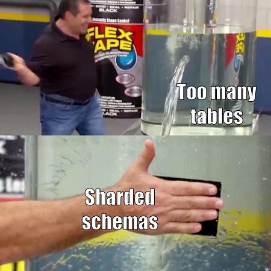]

---

layout: false
class: middle center

### .red[What if, after all, schemas were not enough?]

--


---

layout: true

## The moment of .red[chaos]

---

---

##### Some say:

> When you find out schemas are not enough, you should have enough money to afford a rewrite.

##### But remember:

> Sensible people will see trouble coming and avoid it,
> but an unthinking person will walk right into it and regret it later.
> (Proverbs 22:3 GNT)

---

layout: false
class: middle center

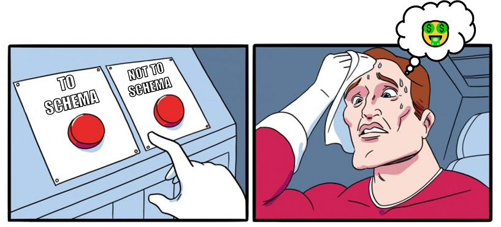

---

layout: false
class: middle

# In conclusion

---

## Is multi-tenancy through schemas de facto wrong as a choice?

<br/>

--

# .green[Absolutely not]

---

## Should you use schemas in your next SaaS project?

<br/>

--

# .green[Why schemas?]

--

# .green[Run the numbers]

---

## Should you change your database architecture to something other than schemas?

<br/>

--

# .green[Would you have used a different architecture should your project have started today?]

--

### .green[Don't panic - There are ways to smartly transition]

---

class: middle center

# 🦉

## .blue[Make your informed decision .emph[with a cold head]]

---

layout: false

## Just in case

##### Alternative packages for shared database:

-   [citusdata/django-multitenant](https://github.com/citusdata/django-multitenant)
-   [raphaelm/django-scopes](https://github.com/raphaelm/django-scopes)

---

layout: false

## And that's it!

##### Want do discuss more?

|         |                                                    |
| ------- | -------------------------------------------------- |
| Twitter | [@lorinkoz](https://twitter.com/lorinkoz)          |
| GitHub  | [github.com/lorinkoz](https://github.com/lorinkoz) |
| Email   | [lorinkoz@gmail.com](mailto:lorinkoz@gmail.com)    |

.center[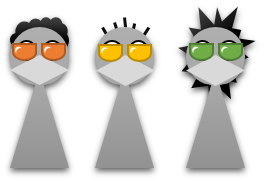]

---

template: title
