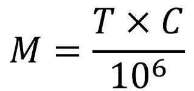

name: title
class: middle

# Of Django, PostgreSQL schemas<br/>and your multi-million dollar idea

---

layout: true

## Talk outline

.bottom[
.footnote[.red[This slide will be excluded from final deck]]
]

---

##### Intro (7 minutes)

-   Django in 2020
-   From multi-tenancy to PostgreSQL schemas
    -   Multi-tenancy and tenants
    -   The active tenant
    -   Database approaches
    -   PostgreSQL schemas
    -   Schemas in Django
-   Why schemas

---

##### Content section 1 (6 minutes)

-   Untangling the schemas
    -   Arranging schemas
    -   Where to put users
    -   Careful with content types
    -   Moving apps between schemas

---

##### Content section 2 (5 minutes)

-   The plot thickens
    -   Faster tenant creation
    -   Cross-tenant aggregations
    -   Migrating the hundreds
    -   Zero-downtime deployments

---

##### Content section 3 (4 minutes)

-   Beware of the behemoth
    -   Tables, tables and more tables
    -   The moment of sharding
    -   The moment of chaos

---

##### Outro (3 minutes)

-   Closing remarks

---

layout: false
class: middle


---

layout: false
class: middle

# From multi-tenancy to PostgreSQL schemas

---

layout: true

## Multi-tenancy

---

-   Customer .red[**red**] has a problem.
-   You develop a solution.
-   Now, customers .blue[**blue**], .green[**green**] and .yellow[**yellow**] have the same problem.

.left-column-66[.box[🤔 What to do?]]
.right-column-33[.right[]]

.bottom[
.footnote[Screenshot of https://store.steampowered.com/app/1291340/Townscaper/]
]

---

.center[]

.bottom[
.footnote[Screenshot of https://store.steampowered.com/app/1291340/Townscaper/]
]

---

.center[]

.bottom[
.footnote[Screenshot of https://store.steampowered.com/app/1291340/Townscaper/]
]

---

.left-column-33[
.center[ Accounts]
]

.left-column-33[
.center[ Workspaces]
]

.left-column-33[
.center[ Blogs]
]

.left-column-33[
.center[ Servers]
]

.left-column-33[
.center[ Stores]
]

.left-column-33[
.center[ Sites]
]

---

layout: true

## The active tenant

---

.todo[Brief notion of the active tenant]

---

layout: true

## Database approaches

---

**Isolated:**<br/>Multiple databases, one per tenant

**Shared:**<br/>One database, tenant column on entry-level tables

**Semi-isolated:**<br/>One database, one schema per tenant (PostgreSQL)

---

layout: true

## PostgreSQL schemas

---

.left-column-66[PostgreSQL schemas.ref[1] can isolate tenants within a single database.
{{content}}]
.right-column-33[.right[]]

.bottom[
.footnote[.ref[1] https://www.postgresql.org/docs/current/ddl-schemas.html]
]

##### Schemas:

-   Layer between database and tables.
-   Equivalent to namespaces.
-   Searchable through the **search path**.

---

.left-column[

]

.right-column[

```sql
SET search_path = tenant1,shared
SET search_path = tenant2,shared
```

]

---

layout: true

## Schemas in Django

---

```python
from django.db.backends.postgresql import base as postgresql


class DatabaseWrapper(postgresql.DatabaseWrapper):
    def _cursor(self, name=None):
        # Over simplified!!!
        cursor = super()._cursor(name=name)
        tenant = get_current_tenant()
        schemas = get_schemas_from_tenant(tenant)
        search_path = ",".join(schemas)
        cursor.execute(f"SET search_path = {search_path}")
        return cursor
```

---

```python
class SchemasDatabaseRouter:

    def allow_migrate(self, db, app_label, model_name, ...):
        tenant = get_current_tenant()
        return `model_belongs_to_tenant`(
            app_label, model_name, tenant
        )
```

.warning[⚠️ The `migrate` command itself requires tweaking]

---

layout: false
class: middle

# Why schemas?

-   Hype.
-   Sense of security.
-   Less burden of queries.
-   Customization of tenants.
-   Backup / restore of tenants.

---

layout: false
class: middle

> Sensible people will see trouble coming and avoid it,
> but an unthinking person will walk right into it and regret it later.
>
> Proverbs 22:3 GNT

---

layout: false
class: middle


---

layout: false
class: middle

# Untangling the schemas

---

layout: true

## Arranging schemas

---

.todo[Diagram of effects of placing models in shared vs private schemas]

---

```python
# settings.py

SHARED_APPS = [...]
TENANT_APPS = [...]

INSTALLED_APPS = SHARED_APPS + TENANT_APPS

```

.box[Why at the app level and not at the model level?]

---

.box[Where to store the tenant catalog?]

---

layout: true

## Where to put users

---


---

.todo[Diagram of placement of each type of user]

---

.left-column[

##### Free users:

-   Require tenant binding via database.
-   Possibly define the active tenant.

]

.right-column[

##### Bound users:

-   Require an active tenant.

]

---

##### Careful with database sessions:

-   Source of leaking authentication.
-   Must be equally or more strict than users.

.box[Keep them together with users]

---

layout: true

## Careful with content types

---

`django.contrib.contenttypes`

##### Helpful for:

-   Generic relations.
-   Polymorphism..ref[1]
-   Other unnamed wizardries.

.bottom[
.footnote[.ref[1] https://github.com/django-polymorphic/django-polymorphic]
]

---

.left-column[

##### Free ctypes:

-   Consistent across tenants.

]

.right-column[

##### Bound ctypes:

-   Portable with tenants.
-   Requires clearing the content types cache when setting the active tenant.

]

---

layout: true

## Moving models between schemas

---

We are using the `allow_migrate` of a database router.

.warning[Migrations are still recorded as being applied]
.warning[Moving models between schemas implies applying migrations again]

---

##### Strategy:

-   Unapply migrations of the app.
-   Change app to schema configuration.
-   Apply migrations of the app.

.box[This is why we operate at the application level]

---

##### .red[What if there is data?]

-   Search path hides the tables.
-   Hard to do with migrations.
-   Recommended with some form of export / import.

.box[Avoid whenever possible]
.box[Carefully design your data layer]

---

layout: false
class: middle


---

layout: false
class: middle

# The plot thickens

---

layout: true

## Faster tenant creation

---

##### By default:

-   Schema creation implies running all migrations from zero.
-   Migrations are not necessarily optimal.
-   Migrations can take time.
-   Additional data initialization can take time.

---

.box[An extra schema for cloning]

-   Keep it up to date with structure.
-   Keep it up to date with initial data.

---

layout: true

## Migrating the hundreds

---


---


---

##### Possible strategies:

-   Sequential
-   Coordinated
-   Time-zone clustered
-   Just-in-time

---

layout: true

## Zero downtime deployments

---

.box[Make your code resilient]

##### Culture:

-   Embrace multi-phase deployments.
-   Always make migrations reversible.

---

##### Strategy:

-   Change code to handle both old and new structure.
-   Mutate structure.
-   Update code for new structure alone.

---

layout: true

## Cross-tenant aggregations

---


---

##### Strategy:

.box[Iterate, of course]

---

##### Careful with IDs:

-   Repeated across tenants.
-   Don't guarantee uniqueness.

.box[Use global identifiers in addition to regular IDs]

---

layout: false
class: middle

# Beware of the behemoth

---

layout: true

## Tables, tables and more tables

---

There is no practical limit on the number of tables in a given database..ref[1]

.bottom[
.footnote[.ref[1] https://www.postgresql.org/message-id/53386E0C47E7D41194BB0002B325C997747F2B@NTEX60]
]

---

In theory, theory is enough, but practice shows otherwise.

.warning[There is a practical limit!]

---

##### Million tables factor

.center[]

.box[`tables_per_tenant \* number_of_tenants / 10\*\*6`]

---

.right[

|            | 50   | 100  | 500  | 1k   | 5k         | 10k        | 50k         | 100k        |
| ---------- | ---- | ---- | ---- | ---- | ---------- | ---------- | ----------- | ----------- |
| .bold[50]  | 0.00 | 0.01 | 0.03 | 0.05 | 0.25       | 0.50       | .red[2.50]  | .red[5.00]  |
| .bold[100] | 0.01 | 0.01 | 0.05 | 0.10 | 0.50       | .red[1.00] | .red[5.00]  | .red[10.00] |
| .bold[150] | 0.01 | 0.02 | 0.08 | 0.15 | .red[0.75] | .red[1.50] | .red[7.50]  | .red[15.00] |
| .bold[200] | 0.01 | 0.02 | 0.10 | 0.20 | .red[1.00] | .red[2.00] | .red[10.00] | .red[20.00] |
| .bold[250] | 0.01 | 0.03 | 0.13 | 0.25 | .red[1.25] | .red[2.50] | .red[12.50] | .red[25.00] |
| .bold[300] | 0.02 | 0.03 | 0.15 | 0.30 | .red[1.50] | .red[3.00] | .red[15.00] | .red[30.00] |

]

.bottom[
.footnote[Columns are number of tenants, rows are number of tables, intersection shows the million tables factor for the given row and column.]
]

---

.right[

|            | 2k   | 3k         | 4k         | 5k         | 6k         | 7k         | 8k         | 9k         |
| ---------- | ---- | ---------- | ---------- | ---------- | ---------- | ---------- | ---------- | ---------- |
| .bold[50]  | 0.10 | 0.15       | 0.20       | 0.25       | 0.30       | 0.35       | 0.40       | 0.45       |
| .bold[100] | 0.20 | 0.30       | 0.40       | 0.50       | 0.60       | 0.70       | .red[0.80] | .red[0.90] |
| .bold[150] | 0.30 | 0.45       | 0.60       | .red[0.75] | .red[0.90] | .red[1.05] | .red[1.20] | .red[1.35] |
| .bold[200] | 0.40 | 0.60       | .red[0.80] | .red[1.00] | .red[1.20] | .red[1.40] | .red[1.60] | .red[1.80] |
| .bold[250] | 0.50 | .red[0.75] | .red[1.00] | .red[1.25] | .red[1.50] | .red[1.75] | .red[2.00] | .red[2.25] |
| .bold[300] | 0.60 | .red[0.90] | .red[1.20] | .red[1.50] | .red[1.80] | .red[2.10] | .red[2.40] | .red[2.70] |

]

.bottom[
.footnote[Columns are number of tenants, rows are number of tables, intersection shows the million tables factor for the given row and column.]
]

---

##### Scary number of tenants

.center[]

.box[`10\*\*6 / tables_per_tenant`]

---

layout: true

## The moment of sharding

---


---

##### Logical shards

-   Schemas will be your minimum decomposable unit.
-   Assign them logical shards in powers of 2.
-   Physical shards must be routed along with schemas.

---

##### What to do with shared apps?

.warning[No cross-database relations allowed.]

-   Sync shared apps across physical shards.
-   Don't have relations with shared apps.

.warning[Extra care with free users]

---

layout: true

## The moment of chaos

---

What if, after all, schemas were not enough?


---

layout: false
class: middle

# In conclusion

---

## Closing remarks

.todo[Answer the questions]

1. Would you be de-facto wrong?
2. Should you use schemas in a green field project?
3. Should you immediately stop using schemas?

---

template: title
